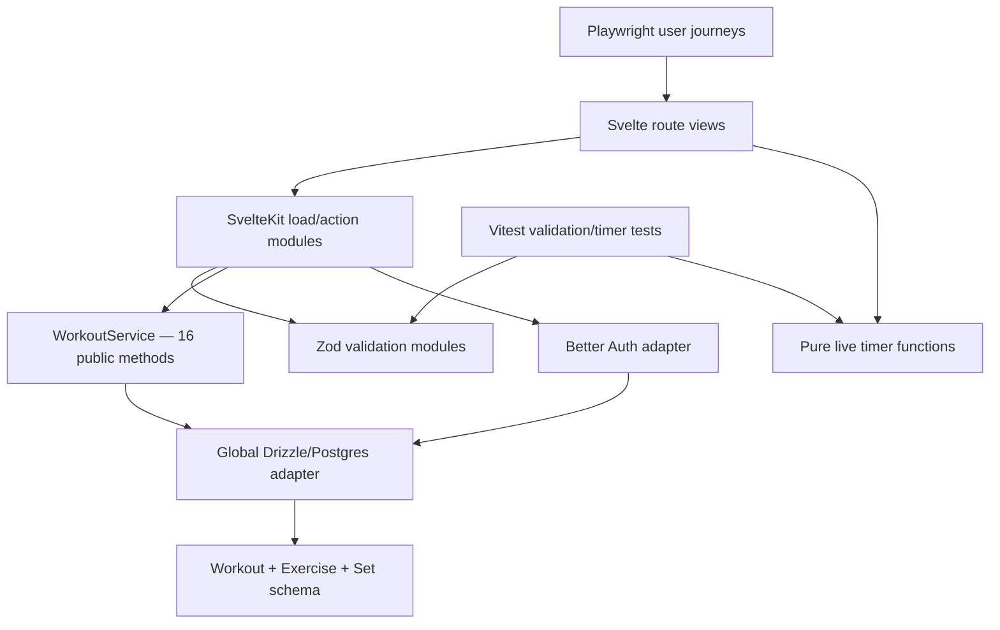

# PumpPal Architecture Audit

**Audit date:** 2026-07-13  
**Audited revision:** `a1c423f` on `main`  
**Scope:** application routes, workout behavior, live training, authentication, persistence, migrations, tests, UI modules, build configuration, and delivery workflow.

## Executive summary

PumpPal has a sound small-application foundation: authentication is centralized, ownership is checked server-side, multi-write workout operations use transactions, live-session transitions use database locks, migration history is committed, and the four primary user journeys have end-to-end coverage.

The main architectural risk is concentration without a stable domain seam. Nearly all workout behavior is growing inside one 689-line persistence-facing module, while two route views (603 and 490 lines) and the workout-detail action module (446 lines) repeat knowledge about the same state. Recent changes confirm these are the dominant change hotspots. The code works, but the interface a maintainer must understand is expanding almost as quickly as the implementation.

The top recommendation is to separate **planned workout prescription** from **performed training record**, then deepen the **Training Session module** around that distinction. Today, completing a set overwrites its planned reps/load, repeating copies those overwritten actuals into the next plan, and reopening rewrites historical timestamps. This is the highest-leverage decision because live training, repetition, history, analytics, progression, and future templates all depend on it.

No exact replacement interfaces are proposed in this audit. Their shape should be designed separately after the domain language is agreed.

## Current architecture map

The diagram shows the central issue: nearly every workout use case crosses the same wide `WorkoutService` seam, but most correctness is verified through browser journeys rather than through that module's interface.

## Findings at a glance

| ID  | Finding                                                                           |             Impact | Recommendation         |
| --- | --------------------------------------------------------------------------------- | -----------------: | ---------------------- |
| A0  | Planned prescription, live execution, and historical record are one mutable model |          Very high | Strong                 |
| A1  | Training Session rules are spread across five modules                             |               High | Strong                 |
| A2  | Workout Builder interface is wide and mixes unrelated change reasons              |               High | Strong                 |
| A3  | Route action modules repeat transport orchestration and erase failure meaning     |               High | Strong                 |
| A4  | Exercise Catalog ownership is undefined and currently global                      |               High | Strong                 |
| A5  | Persistence misses core indexes and uses row-at-a-time writes                     | High as data grows | Strong                 |
| A6  | Calendar dates and instants share ad hoc time handling                            |             Medium | Worth exploring        |
| A7  | Large route views contain several behavioral modules in one file                  |             Medium | Worth exploring        |
| A8  | The real workout interface has no direct integration test surface                 |               High | Strong                 |
| A9  | Database defaults and constraints do not fully agree                              |             Medium | Strong, small fix      |
| A10 | Storybook is a disconnected starter tree, not an application UI adapter           |        Low/ongoing | Strong, small deletion |
| A11 | Schema delivery has two competing workflows and no CI gate                        | High operationally | Strong                 |
| A12 | Domain language and architectural decisions are undocumented                      | Medium/compounding | Strong                 |
| A13 | Exercise/set ordering is an unprotected caller convention                         |             Medium | Strong                 |
| A14 | Browser tests lack a deterministic database harness                               | Medium/compounding | Strong                 |
| A15 | `live-workout.ts` is a shallow arithmetic extraction                              |            Low now | Worth exploring        |

## Detailed findings

### A0. Separate planned prescription from performed training record

**Recommendation:** Strong — top priority  
**Dependency category:** domain/data model

**Files**

- `src/lib/server/db/schema.ts:94-114,164-182`
- `src/lib/server/services/workout.service.ts:163-183,237-291,387-458`
- `src/routes/workouts/[workoutId]/+page.svelte:397-478`

**Problem.** One mutable row graph represents a planned workout, an active execution, and a finished performance record. Set target reps/load are overwritten with actual reps/load at completion. Repetition then copies the overwritten values into a new plan. Reopening reconstructs and overwrites `startedAt` and clears the previous `finishedAt`. Builder-created sets also default to completed even when the workout itself is planned.

**Evidence.** `completeLiveSet` writes actual values back to `set.reps` and `set.weight`; `repeatWorkout` later copies those same fields; `reopenWorkout` replaces historical session timestamps. The data model therefore cannot retain target-versus-actual performance, and multiple reopen/finish cycles rewrite history.

**Deepening direction.** Define the distinction between a workout prescription and a performed training record before adding analytics, progression, or templates. Preserve immutable performance facts and make any correction workflow explicit. Place the lifecycle seam from A1 using this domain distinction.

**Benefits**

- Target versus actual survives
- History stops being rewritten
- Repeat behavior becomes intentional
- Analytics gain trustworthy inputs
- Future templates have a seam

**Deletion test.** Without this domain module, plan/performance meaning remains duplicated across schema fields, cloning SQL, live mutations, UI labels, and analytics callers. The seam would concentrate real complexity.

### A1. Deepen the Training Session module

**Recommendation:** Strong  
**Dependency category:** in-process with a Postgres implementation

**Files**

- `src/lib/server/services/workout.service.ts:95-345`
- `src/lib/server/db/schema.ts:95-123,164-191`
- `src/routes/workouts/[workoutId]/live/+page.server.ts:15-130`
- `src/routes/workouts/[workoutId]/live/+page.svelte:1-490`
- `src/lib/live-workout.ts:1-19`

**Problem.** The lifecycle interface is not located at one seam. Callers must understand status strings, legal transitions, row-lock requirements, duplicated `completed`/`status` state, absolute rest deadlines, elapsed-time reconstruction, and route-specific error mapping. The pure timer functions are easy to test, but the risky behavior lives in how database state and those calculations are coordinated.

**Evidence.** Seven public methods implement training commands, each exposing IDs and persistence-shaped failures. Lock acquisition and ownership predicates are repeated across `finishWorkout`, `activateSet`, `completeLiveSet`, and `skipSet`. The live route separately maps every thrown error to a generic `409`. The UI independently branches on all workout and set statuses.

Database checks constrain the status vocabulary but not the full lifecycle shape: an active workout can theoretically lack `startedAt`, and a finished workout can lack timing/duration. The finished detail view still renders most edit/add controls even though the persistence implementation rejects them, duplicating editability knowledge across UI and server.

**Deepening direction.** Concentrate the lifecycle, set-state invariants, rest deadline, transaction discipline, and meaningful outcomes in one Training Session module. Keep Postgres queries internal to its implementation. Treat the route as an adapter and the module's interface as the integration-test surface.

**Benefits**

- Locality: transition bugs concentrate
- Leverage: one rule, all callers
- Interface becomes the test surface
- Persistence details stop leaking
- UI consumes stable session meaning

**Deletion test.** Deleting the proposed module would redistribute transition rules across route actions, SQL mutations, UI branches, and tests. That is evidence the seam would earn its keep.

### A2. Separate and deepen the Workout Builder module

**Recommendation:** Strong  
**Dependency category:** in-process

**Files**

- `src/lib/server/services/workout.service.ts:348-689`
- `src/routes/workouts/[workoutId]/+page.server.ts:44-446`
- `src/lib/types/workout.validation.ts:12-87`

**Problem.** `WorkoutService` has 16 public methods spanning listing, creation, editing, deletion, repetition, exercise catalog access, set ordering, and live execution. Its interface is broad, and the file changes for unrelated reasons. The detail route adds another 10 action adapters that repeat the same orchestration shape.

**Evidence.** Recent history records 837 changed lines across four touches in this module. Reordering a set, cloning a workout, creating a global exercise, locking a completed workout, and running a session all share the same class and database singleton. The module is not shallow in the deletion-test sense—it hides substantial SQL—but its interface has lost locality.

**Deepening direction.** Preserve the valuable transaction implementations but gather builder behavior around the Workout Builder domain seam and training behavior around the Training Session seam. Validation should remain at the transport edge; domain invariants and outcomes belong behind the relevant module interface.

**Benefits**

- Locality by use case
- Smaller interfaces to learn
- Fewer unrelated file changes
- Transaction knowledge stays internal
- Tests target domain behavior

### A3. Make route actions thin adapters without losing error meaning

**Recommendation:** Strong  
**Dependency category:** adapter

**Files**

- `src/routes/workouts/[workoutId]/+page.server.ts:17-446`
- `src/routes/workouts/[workoutId]/live/+page.server.ts:10-130`
- `src/routes/workouts/new/+page.server.ts:5-51`
- `src/routes/auth/+page.server.ts:6-46`
- `src/routes/auth/register/+page.server.ts:6-54`

**Problem.** Route adapters repeatedly parse form data, validate IDs, check authentication, invoke one method, catch every error, and manufacture a response. At the same time, generic `Error` values from the implementation are collapsed into `404`, `409`, or `500` responses, so caller mistakes, illegal state, missing records, and database failures can become indistinguishable.

**Evidence.** Authentication checks appear in every protected load/action. `parseWorkoutId` and `routeId` duplicate the same rule. The detail action module contains ten `try/catch` blocks and ten hand-built response shapes. Several catches convert any failure—including an operational database failure—to “not found” or “not available.”

**Deepening direction.** Keep SvelteKit-specific redirects and `fail` responses in route adapters, but move stable command outcomes and failure categories behind the relevant domain module interface. Consolidate only genuinely repeated transport mechanics; do not add a pass-through helper for every action.

**Benefits**

- Route adapters become shallow by design
- Domain modules gain depth
- Failures retain meaning
- Logging becomes actionable
- Response shapes stay consistent

### A4. Decide the Exercise Catalog ownership seam

**Recommendation:** Strong  
**Dependency category:** domain/data model

**Files**

- `src/lib/server/db/schema.ts:78-90`
- `src/lib/server/services/workout.service.ts:72-74,494-535`
- `src/routes/workouts/[workoutId]/+page.server.ts:32-35`

**Problem.** The schema calls `exercise` a master list, but every athlete can create rows in that global list. Names are globally unique, there is no owner, and `getExercises()` returns every row to every signed-in user. A custom exercise created by one athlete therefore becomes visible to all athletes and can prevent them from using the same name.

**Evidence.** `exercise` has no `userId`; `name` is globally unique; `createExerciseForWorkout` inserts directly into the catalog; and `getExercises` has no ownership or visibility predicate.

**Deepening direction.** Define whether the Exercise Catalog is curated, personal, or hybrid before adding more features. Put visibility, naming, reuse, and creation rules behind that domain seam. Record the decision in `CONTEXT.md` and an ADR if it changes persistence.

**Benefits**

- Locality: catalog rules centralize
- Prevents cross-user leakage
- Naming semantics become explicit
- Future search has one seam
- Tests express visibility rules

### A5. Deepen persistence around actual query paths

**Recommendation:** Strong  
**Dependency category:** Postgres implementation

**Files**

- `src/lib/server/db/schema.ts:95-191`
- `src/lib/server/services/workout.service.ts:64-92,119-159,186-331,387-458,568-687`
- `drizzle/0000_confused_zeigeist.sql`
- `drizzle/0001_loud_living_mummy.sql`

**Problem.** The implementation relies on ownership and parent-child joins for nearly every request, but foreign-key and ownership columns have no indexes. Reordering, finishing, activation, repetition, and deletion also execute row-at-a-time updates inside transactions.

**Evidence.** The only application index is the unique repeat-token index. There are no indexes on `workout.user_id`, `workout_exercise.workout_id`, `workout_exercise.exercise_id`, or `set.workout_exercise_id`. Reorder and active-set resets loop over rows and issue one update per row.

**Deepening direction.** Make query shape and data invariants part of the Postgres implementation, not knowledge each caller carries. Add indexes that match ownership and nested-load paths, and replace row-at-a-time mutations with set-based statements where measurement shows leverage.

**Benefits**

- Stable latency as data grows
- Shorter lock duration
- Fewer database round trips
- Query knowledge gains locality
- Performance tests hit one seam

### A6. Create one temporal model for calendar dates and instants

**Recommendation:** Worth exploring  
**Dependency category:** in-process

**Files**

- `src/lib/server/db/schema.ts:103,110-114,181-182`
- `src/lib/server/services/workout.service.ts:52,135-138,177,270-285,404-407`
- `src/routes/workouts/new/+page.svelte:6-10`
- `src/routes/workouts/[workoutId]/+page.svelte:13,26`
- `src/lib/live-workout.ts:1-19`

**Problem.** A workout's calendar day and session instants are all represented as JavaScript `Date`/Postgres timestamp values, while conversion policy is scattered. Creation uses local noon, repetition uses UTC noon, editing serializes through UTC, and display uses the browser locale.

**Evidence.** `new Date(date + 'T12:00:00')`, `Date.UTC(..., 12)`, and `toISOString().slice(0, 10)` encode three different policies. Postgres columns use timestamp without an explicit timezone mode. Noon reduces some rollover risk but does not define the domain semantics.

**Deepening direction.** Distinguish a calendar workout date from elapsed-time instants, then centralize conversion and formatting inside a temporal module. The interface should hide timezone policy from routes and persistence callers.

**Benefits**

- One timezone policy
- Date bugs gain locality
- Repeat preserves intended day
- Tests cover edge zones
- Callers stop converting dates

### A7. Extract behavioral UI modules from the route views

**Recommendation:** Worth exploring  
**Dependency category:** in-process UI

**Files**

- `src/routes/workouts/[workoutId]/+page.svelte` (603 lines)
- `src/routes/workouts/[workoutId]/live/+page.svelte` (490 lines)
- `src/app.css`

**Problem.** Each route view contains multiple forms, status rendering, confirmation behavior, loading state, error targeting, and extensive styling. Understanding one set interaction requires scanning hundreds of unrelated markup lines. The detail view is the repository's largest change hotspot: 1,081 changed lines across five recent touches.

**Evidence.** The detail view owns workout editing, deletion, repeating, exercise removal, set editing/deletion/addition, catalog selection, custom exercise creation, and all status feedback. The live view owns timers, accessible announcements, progress, lifecycle entry states, set activation/completion/skipping, and a 280+ line style block.

**Deepening direction.** Extract modules only where behavior and state move together—for example, a rest experience or set editor—not one markup fragment per file. Use the deletion test: removing the module should scatter meaningful behavior, not merely HTML.

**Benefits**

- Locality for set behavior
- Route view shows composition
- Focused accessibility tests
- Styles follow behavior
- Fewer merge hotspots

### A8. Test through the workout module interface

**Recommendation:** Strong  
**Dependency category:** test architecture

**Files**

- `src/lib/server/services/workout.service.ts`
- `src/lib/types/validation.test.ts`
- `src/lib/live-workout.test.ts`
- `e2e/workout-management.test.ts`
- `e2e/repeat-workout.test.ts`
- `e2e/live-workout.test.ts`

**Problem.** The risky transaction and ownership behavior is not tested through its own interface. Unit tests cover validation and timer arithmetic; browser tests cover broad journeys. Failures in lock ordering, state transitions, cloning, reordering, or error meaning are therefore slow to isolate and require full UI setup.

**Evidence.** No test imports `workout.service.ts`. There are 11 unit tests, primarily schema parsing and three timer calculations, and four end-to-end journeys against a shared local Postgres instance. Playwright does not create, migrate, reset, or clean that database; tests generate random athletes, persist all records, duplicate the same registration helper in three files, and run with one worker, which masks concurrency behavior.

**Deepening direction.** After the domain seams are established, make their interfaces the primary integration-test surface against Postgres. Keep a small number of end-to-end journeys for adapter wiring and accessibility. Do not introduce a repository seam solely for mocking: one adapter is hypothetical; add a seam only when a second real adapter exists.

**Benefits**

- Interface is the test surface
- Transaction failures isolate quickly
- Ownership tests become concise
- Browser suite stays focused
- Refactors retain confidence

### A9. Align database defaults with invariants

**Recommendation:** Strong, small fix  
**Dependency category:** Postgres implementation

**Files**

- `src/lib/server/db/schema.ts:164-190`
- `drizzle/0002_glossy_annihilus.sql`
- `drizzle/0003_fixed_proemial_gods.sql`

**Problem.** A set defaults to `completed = true` and `status = 'planned'`, while a database check requires completion to equal whether status is `completed`. An insert that relies on both defaults is invalid. Additional validated facts—nonnegative reps/load/rest and allowed weight units—are not database invariants.

**Evidence.** Current application paths explicitly synchronize completion fields, so normal UI requests succeed, but the schema's own default row contradicts its check constraint. `weightUnit` remains free-form varchar at persistence level.

**Deepening direction.** Make defaults, checks, and application state agree. Keep invariant definitions in the Postgres implementation and expose valid domain values through the module interface.

**Benefits**

- Valid rows by default
- Imports cannot bypass rules
- Less duplicated synchronization
- Migration behavior is explicit
- State assumptions stay local

### A10. Remove or replace the disconnected Storybook starter tree

**Recommendation:** Strong, small deletion  
**Dependency category:** tooling

**Files**

- `src/stories/**`
- `.storybook/**`
- Storybook dependencies/scripts in `package.json`

**Problem.** The repository tracks the generated Storybook tutorial modules and assets, but application routes import none of them. They describe a different visual system, create a second UI tree, and imply UI coverage that the default test command does not run.

**Evidence.** All imports within `src/stories` are internal to that directory. `npm test` runs unit and end-to-end projects, not `test:storybook`. The README describes Storybook as the UI module despite application UI being route-local.

**Deepening direction.** Delete the starter tree and its dependencies, or replace it with stories for real behavioral UI modules after those modules exist. Do not preserve Storybook as a hypothetical seam.

**Benefits**

- Deletion removes false structure
- Tooling matches real UI
- Dependency surface shrinks
- Tests stop implying coverage
- AI navigation loses noise

### A11. Choose one schema-delivery path and enforce it

**Recommendation:** Strong  
**Dependency category:** delivery

**Files**

- `README.md`
- `package.json`
- `drizzle/**`
- missing `.github/workflows/**`

**Problem.** The repository commits ordered migrations and exposes `db:migrate`, but setup instructions tell every environment to run `db:push`. There is no CI workflow, migration smoke test, production release definition, or schema-drift gate.

**Evidence.** `README.md` instructs `npm run db:push`; `package.json` includes both push and migrate; four migrations and snapshots are committed; no CI/deployment files exist.

**Deepening direction.** Make migration application a delivery module with one documented path per environment. CI should typecheck, lint, test, build, and apply migrations to an empty Postgres database before code can merge.

Pin the floating `postgres` Docker image to a known major/version so local schema behavior does not change silently.

**Benefits**

- Schema drift becomes visible
- Migrations prove reproducible
- Main stays deployable
- Delivery knowledge gains locality
- New environments match production

### A12. Establish the domain language and decision record

**Recommendation:** Strong  
**Dependency category:** architecture knowledge

**Files**

- Missing `CONTEXT.md`
- Missing `docs/adr/**`
- `src/lib/server/db/schema.ts`
- `README.md`

**Problem.** Core terms are underspecified. “Workout” currently means a planned routine, a live execution, and a finished log. “Exercise” is described as a master catalog item but is created by athletes. “Completed” exists as both a boolean and status. Without a glossary or ADRs, future features must infer these semantics from SQL and UI branches.

**Evidence.** No `CONTEXT.md` or ADR directory exists. The README promises future suggestions and performance insights but does not define whether workouts are templates, occurrences, or both.

**Deepening direction.** Add a short ubiquitous-language glossary first, then record load-bearing decisions as ADRs when they arise. Name deep modules after domain concepts, not current file names.

**Benefits**

- AI navigation gains context
- Seams use domain names
- Reviews stop re-litigating decisions
- Data ownership becomes explicit
- Future analytics share meaning

### A13. Protect exercise and set ordering as a persistence invariant

**Recommendation:** Strong  
**Dependency category:** Postgres implementation

**Files**

- `src/lib/server/db/schema.ts:137-146,164-182`
- `src/lib/server/services/workout.service.ts:537-565,568-650,655-687`

**Problem.** `workoutExercise.order` is nullable, and set numbering has no uniqueness constraint within an exercise. Add-set trusts the caller's requested number without repositioning existing rows. Update and delete repair numbering with sequential updates, so concurrent/direct requests can create duplicates or gaps.

**Deepening direction.** Put insertion, movement, deletion, and normalization behind the Workout Builder implementation and enforce the chosen invariant at the persistence seam. Use set-based mutations where possible.

**Benefits**

- Ordering rules gain locality
- Concurrent adds stay valid
- Forms stop owning invariants
- Repeat preserves stable order
- Fewer database round trips

### A14. Add a deterministic browser-test harness

**Recommendation:** Strong  
**Dependency category:** test architecture

**Files**

- `playwright.config.ts`
- `e2e/workout-management.test.ts:3-19`
- `e2e/repeat-workout.test.ts:3-19`
- `e2e/live-workout.test.ts:3-19`

**Problem.** The browser suite depends on an externally running, already-shaped database and leaves random user/workout rows behind. Setup behavior is duplicated, isolation is implicit, and `workers: 1` makes order/concurrency mistakes less visible.

**Deepening direction.** Create a test-harness module that owns database creation/migration/reset, athlete setup, authentication, and test-data lifetime. Keep browser tests focused on adapter wiring and user behavior; exercise transactions at the domain module interface.

**Benefits**

- Repeatable test database
- Setup logic gains locality
- Parallelism becomes possible
- Failures isolate faster
- CI can start from empty

### A15. Replace the shallow timer extraction with behavioral depth

**Recommendation:** Worth exploring  
**Dependency category:** in-process UI

**Files**

- `src/lib/live-workout.ts:1-19`
- `src/lib/live-workout.test.ts:1-21`
- `src/routes/workouts/[workoutId]/live/+page.svelte:6-42`

**Problem.** `live-workout.ts` contains three short calculations, has one caller, and its tests mostly restate the arithmetic. Deleting it moves only three expressions back to one file; meaningful complexity does not concentrate. The actual risk is coordination among persisted deadlines, one-second ticks, visibility changes, hydration, and accessible announcements, which remains in the route view.

**Deepening direction.** If extracted, move the complete live timer behavior behind one interface and keep arithmetic internal. Otherwise inline the shallow functions and test the route behavior. Do not preserve a hypothetical seam solely because pure functions are easy to unit test.

**Benefits**

- Tests cover real behavior
- Visibility logic gains locality
- Accessible announcements stay coupled
- One caller learns less
- Shallow structure disappears

## Positive architecture worth preserving

- **Authentication seam:** Better Auth is centralized in `src/lib/auth.ts`; request session loading is centralized in `src/hooks.server.ts`.
- **Ownership enforcement:** Workout access is consistently scoped by `userId` in server-side queries.
- **Transaction discipline:** Multi-row mutations use Postgres transactions and lock the workout row before state-sensitive writes.
- **Database invariants:** Live status values and completion consistency have explicit check constraints and migrations.
- **Idempotent repetition:** Repeat tokens provide a durable safeguard against duplicate submissions.
- **Absolute rest deadline:** Rest timing derives from `restEndsAt`, so background tabs and refreshes do not create interval drift.
- **Migration history:** Schema changes and snapshots are committed rather than left only in local state.
- **User-journey coverage:** Authentication, ownership, workout management, repetition, and live execution have end-to-end tests.

## Recommended sequence

1. **Name the domain:** create `CONTEXT.md`; distinguish workout prescription from performed training record; decide Exercise Catalog visibility.
2. **Immediate integrity and noise cleanup:** align set defaults/checks, protect ordering, add missing query indexes, pin Postgres, remove or replace the starter Storybook tree.
3. **Deepen Training Session:** preserve historical facts, concentrate lifecycle rules and meaningful outcomes, and add Postgres integration tests through its interface.
4. **Deepen Workout Builder:** gather creation, editing, repetition, exercise, set ordering, and lock rules at a cohesive seam.
5. **Build deterministic test and delivery modules:** reset/migrate an isolated database and enforce checks in CI.
6. **Thin the adapters:** reduce route duplication once the deeper domain interfaces return stable outcomes.
7. **Extract behavioral UI modules:** move stateful set/rest/editor behavior out of route monoliths and test accessibility locally.

## Candidate priority matrix

| Candidate                       | Correctness leverage | Change locality | Test leverage |      Effort |
| ------------------------------- | -------------------: | --------------: | ------------: | ----------: |
| Plan/performance domain split   |            Very high |       Very high |     Very high |        High |
| Training Session module         |            Very high |       Very high |     Very high |      Medium |
| Exercise Catalog ownership      |                 High |            High |          High | Medium–high |
| Persistence indexes/invariants  |                 High |            High |        Medium |         Low |
| Workout Builder module          |                 High |       Very high |          High |      Medium |
| Direct module integration tests |                 High |            High |     Very high |      Medium |
| Behavioral UI modules           |               Medium |            High |          High |      Medium |
| Temporal model                  |               Medium |            High |          High |      Medium |
| Delivery path and CI            |   High operationally |            High |          High |      Medium |
| Domain glossary/ADRs            |               Medium |            High |        Medium |         Low |
| Storybook starter deletion      |                  Low |          Medium |           Low |         Low |

## Audit method and limits

The audit inspected all tracked application, test, migration, configuration, and Storybook files; mapped imports and public methods; reviewed the current schema and migration constraints; counted module sizes; examined recent Git change hotspots; and applied the deletion test to suspected shallow modules.

This is a static architecture audit, not a production performance profile or penetration test. Index recommendations are based on observed query predicates and joins and should be validated with representative data and `EXPLAIN`. Exercise Catalog ownership is a confirmed implementation behavior but a domain defect only if global visibility is not intended; that decision must be made explicitly.
